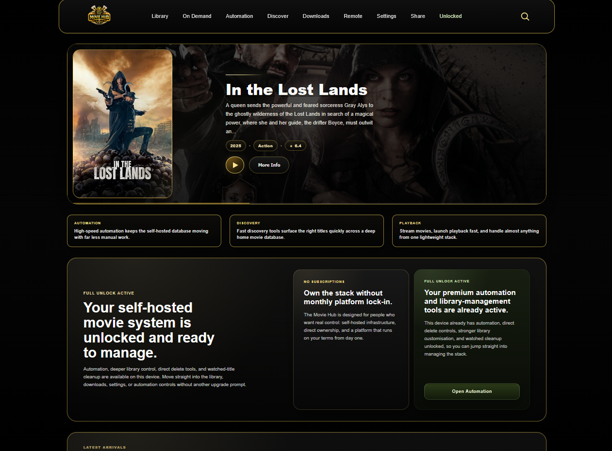
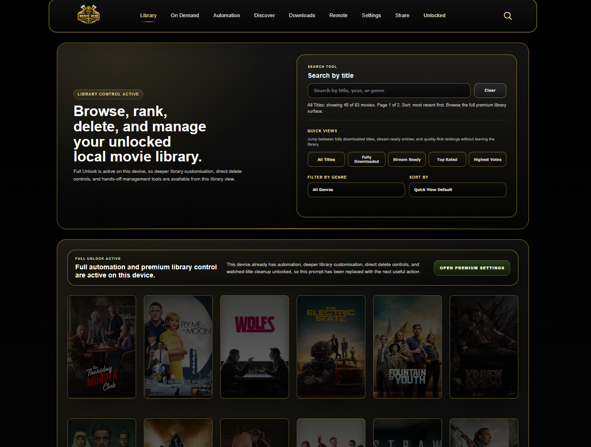
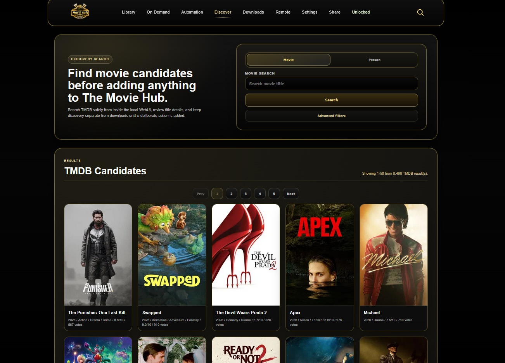
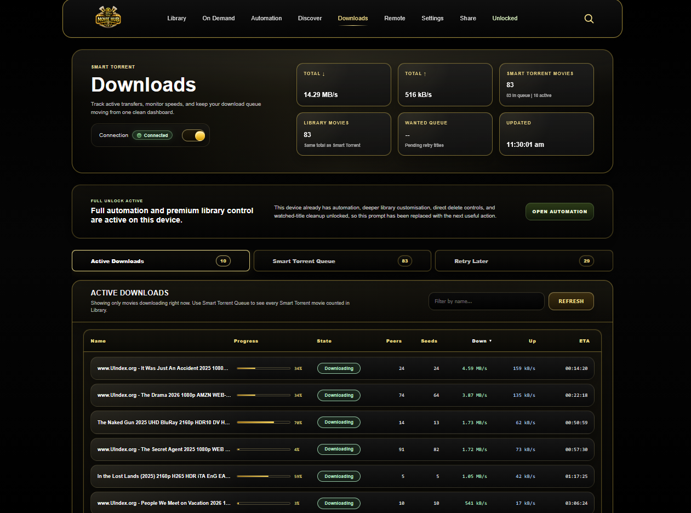
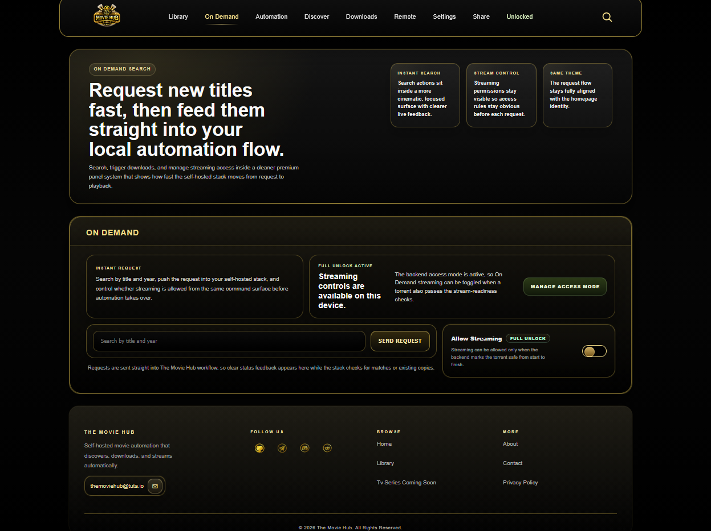
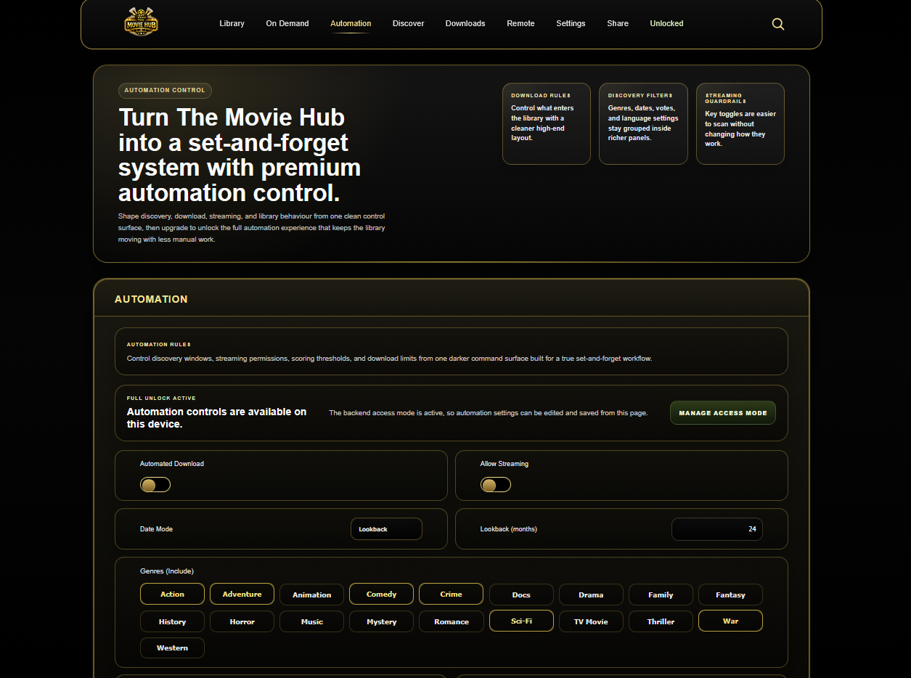
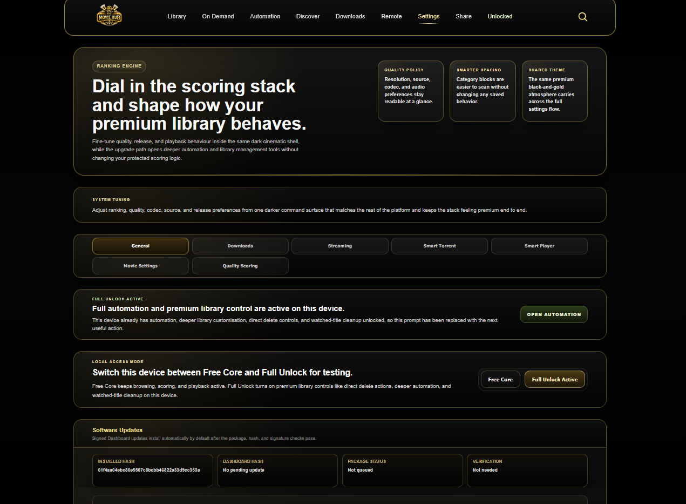
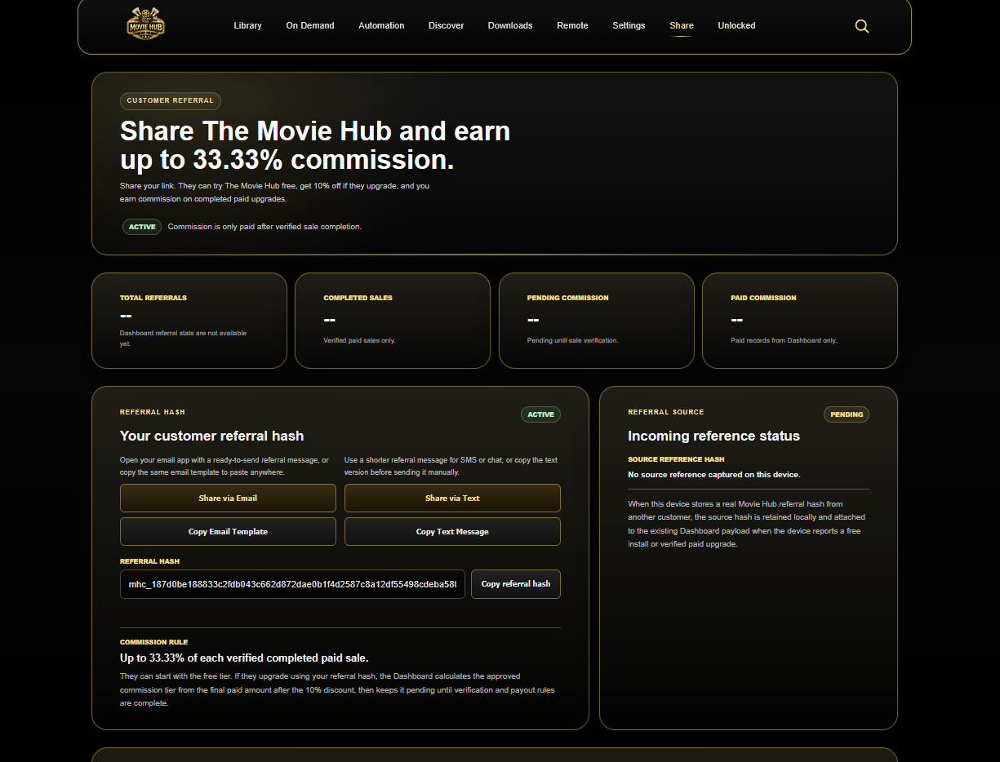
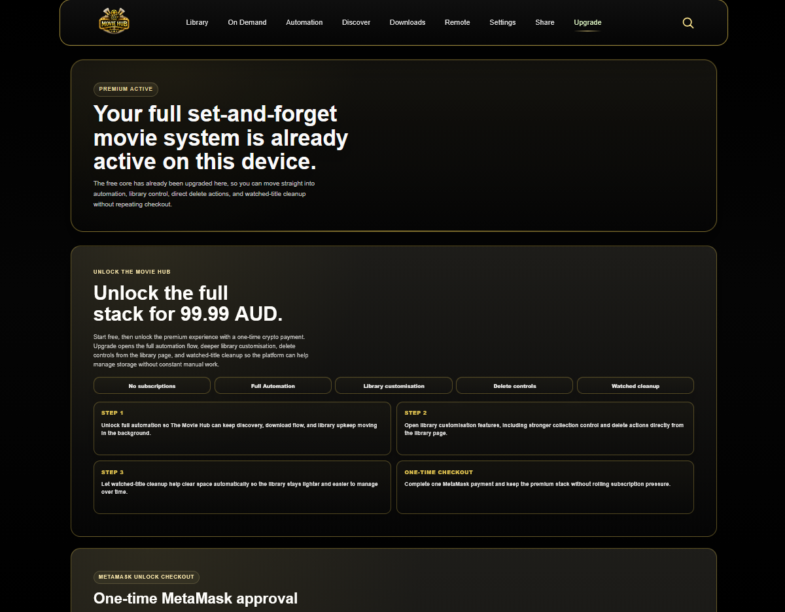

# 🎬 The Movie Hub

**The Movie Hub** is a super lightweight, fully automated, headless home media system built in modern **C++23** for fast local movie discovery, downloading, streaming, playback, and library management.

It is designed for power users who want a portable, low-overhead, self-hosted movie stack that can run 24/7 on Windows with a responsive WebUI, a custom Smart Torrent engine, signed software updates, Smart Player playback, TMDB metadata, Jackett search, referral sharing, and optional Full Unlock features.

Download the latest release here:

[TheMovieHub/The-Movie-Hub](https://github.com/TheMovieHub/The-Movie-Hub/releases)

---

## ✨ Key Features

- ⚡ Ultra-lightweight C++23 architecture built for low CPU and memory use
- 🎬 Automated movie discovery, validation, download, streaming, organization, and playback
- 🧲 Custom Smart Torrent engine with queueing, active slots, slow-torrent replacement, and stream-aware downloads
- 🚀 High-throughput torrent ingestion, tested around ~2 torrents per second / ~7,200 per hour
- 🎥 Smart Player powered by libmpv with hardware-aware playback tuning
- 🔍 Jackett-powered torrent aggregation
- 🧠 TMDB metadata matching for posters, backdrops, genres, cast, discovery, and title validation
- 🛡️ Multi-layer filtering for title, year, genre, language, file type, banned words, duplicates, and storage limits
- 💾 Smart storage guard with separate library, download, and streaming folders
- 📱 Responsive WebUI for desktop, tablet, and mobile
- 🔑 Customer TMDB API key setup inside Settings
- 🔄 Signed software update system with package hash and signature verification
- 🧩 Modular design across Home Control, Automation, Smart Torrent, Smart Player, and WebUI
- 🔐 Privacy-conscious telemetry relay through local Home Control, with aggregate dashboard reporting only
- 🎁 Referral sharing with discount and commission support
- 💳 Optional Full Unlock flow with MetaMask / Base mainnet support

---

## 🖥️ Screenshot Highlights

The main README keeps a focused set of screenshots so the GitHub page loads quickly. Additional screenshots can live in the release assets or a separate gallery.

### Home

### Library

### Discovery

### Downloads

### On Demand

### Automation

### Settings

### Share

### Unlock

---

## 🧠 Architecture Overview

The Movie Hub is split into focused native components:

- **Home Control Server**  
  Local orchestration layer for WebUI APIs, runtime settings, TMDB and Jackett config, Smart Torrent control, Smart Player handoff, signed updates, hardware identity, privacy relay, and unlock state.

- **Full Automation Engine**  
  Handles discovery rules, scheduling, filtering, validation, queue handling, and automated movie acquisition.

- **Smart Torrent Engine**  
  Custom torrent engine for high-volume ingestion, active slot management, queue control, stream-mode downloads, slow-torrent replacement, and download lifecycle monitoring.

- **Smart Player**  
  libmpv-based local player with hardware-aware defaults, playback profiles, resume support, and streaming-ready playback.

- **WebUI Frontend**  
  Lightweight local interface for Home, Library, Discovery, Downloads, On Demand, Automation, Settings, Share, Upgrade, Remote, and movie detail pages.

- **Signed Update Layer**  
  Verifies update packages using package hashes, detached signatures, release metadata, and staged preflight checks before applying updates.

---

## 🛠️ Tech Stack

- **Language:** C++ / C++23
- **HTTP:** cpp-httplib, libcurl, WinHTTP
- **Torrent Engine:** Custom Smart Torrent
- **Indexer:** Jackett
- **Playback:** libmpv Smart Player
- **Metadata:** TMDB
- **JSON:** nlohmann/json
- **Matching:** rapidfuzz plus custom title normalization
- **Filesystem:** std::filesystem
- **Frontend:** HTML, CSS, JavaScript
- **Payments:** MetaMask / EVM wallet flow on Base mainnet
- **Updates:** Signed ZIP package verification
- **Platform:** Portable Windows local install

---

## ⚙️ First Run Setup

1. Download the latest release from:

   [TheMovieHub/The-Movie-Hub](https://github.com/TheMovieHub/The-Movie-Hub/releases)

2. Extract the ZIP to a normal writable folder, for example:

   `C:\The Movie Hub`

3. Start **Movie Hub Home Control**.

4. Open the local WebUI in your browser.

5. Go to **Settings → General → TMDB Metadata Key**.

6. Create a free TMDB account and generate an **API Key (v3 auth)**.

7. Paste the TMDB API key into Settings and save it.

8. Configure your movie library, download, and streaming folders.

9. Configure Jackett if you want torrent aggregation through your own Jackett setup.

10. Open **Settings → Smart Torrent** and confirm active slots, queue behavior, speed limits, and storage guard settings.

11. Open **Settings → Smart Player** and confirm playback profile, hardware acceleration, and subtitle/audio preferences.

12. Use **Discovery**, **On Demand**, or **Automation** to search, queue, download, stream, and manage movies.

13. Optional: open **Upgrade** to unlock premium features.

14. Optional: open **Share** to copy your referral template and share The Movie Hub with others.

---

## 🔑 TMDB Metadata Setup

The Movie Hub uses **TMDB** for posters, backdrops, genres, cast details, discovery, title matching, and cleaner library metadata.

Customers can add their own free TMDB key inside:

**Settings → General → TMDB Metadata Key**

Use the TMDB **API Key (v3 auth)**.

Do not use the longer TMDB API Read Access Token.

The saved key is stored locally in:

`The Movie Hub/config/credentials.conf`

The WebUI only shows a masked version after saving and does not print the full key back to the browser.

---

## 🧲 Smart Torrent

The custom Smart Torrent engine is built for continuous local automation:

- Active slot management
- Queue prioritization
- Slow torrent replacement
- Stream-ready MKV detection
- Download lifecycle monitoring
- Software update seeding support
- Large candidate ingestion
- Streaming-aware download handling
- Local-first status reporting through the WebUI

---

## 🎥 Smart Player

Smart Player is built around **libmpv** and supports:

- Local movie playback
- Stream-ready playback while supported downloads are still in progress
- Hardware-aware playback defaults
- Resume support
- Playback profiles
- Subtitle and audio handling
- Remote playback control from the WebUI

---

## 🔄 Signed Software Updates

The Movie Hub includes a signed update flow designed for portable installs.

Update packages are verified before use with:

- Package SHA-256
- Detached signature
- Public key metadata
- Manifest checks
- Staging checks
- Apply preflight checks

The app verifies update integrity before preparing or applying an update.

---

## 🎁 Share & Referral System

The Share page gives customers a referral hash and ready-to-copy templates for email, text, and manual sharing.

Shared messages direct new users to:

[TheMovieHub/The-Movie-Hub](https://github.com/TheMovieHub/The-Movie-Hub/releases)

Referral attribution is designed to work across copied installs without copying generated runtime privacy data.

---

## 🔐 Privacy-Aware Reporting

The Movie Hub uses local Home Control for small aggregate status payloads.

The WebUI does not expose private dashboard endpoints, private relay credentials, hidden-service keys, or generated runtime Tor data.

Dashboard reporting is designed around aggregate app statistics such as installs, tier status, heartbeats, country-level counts, and update availability.

---

## 💳 Free Core & Full Unlock

The Movie Hub includes a free tier and optional Full Unlock flow.

The Upgrade page supports:

- Free Core status
- Full Unlock information
- Referral hash entry
- MetaMask wallet connection
- Base mainnet checkout flow
- Local unlock verification
- Premium feature access after successful unlock

Unlock state is handled through Home Control and should not depend on customer-editable frontend-only files.

---

## 🛡️ Filtering & Safety

The Movie Hub applies multiple validation layers before downloading:

- TMDB title and year matching
- Poster and backdrop metadata
- Genre enforcement
- Date range rules
- Language and subtitle preferences
- Banned word filtering
- File type validation
- Title-to-file verification
- Duplicate prevention
- CSV inventory checks
- Hash tracking
- Storage guard enforcement
- Queue handling for unavailable or slow downloads

---

## 💾 Smart Storage Management

The Movie Hub supports:

- User-defined movie library folder
- Temporary download folder
- Streaming folder
- Storage guard limits
- Cleanup controls
- Library refresh tools
- Duplicate protection
- Long-running automation without uncontrolled disk growth

---

## 📺 WebUI Pages

- **Home**  
  Local dashboard, feature overview, latest arrivals, and system status.

- **Library**  
  Local movie library with search, filters, sorting, pagination, quick views, and management tools.

- **Discovery**  
  TMDB-powered discovery with filters, detail views, and download actions.

- **Downloads**  
  Smart Torrent status, active slots, queue state, progress, speed, and torrent controls.

- **On Demand**  
  Search and request a movie directly.

- **Automation**  
  Automation status, rules, scheduling, and premium automation controls.

- **Settings**  
  Runtime paths, TMDB key, Jackett config, Smart Torrent, Smart Player, quality scoring, privacy, updates, and reset tools.

- **Share**  
  Referral hash, share templates, copied install support, and referral status tools.

- **Upgrade**  
  Free Core and Full Unlock flow with wallet checkout support.

- **Remote**  
  Playback and control interface for local Smart Player sessions.

---

## ⚡ Performance

The Movie Hub is built for:

- 24/7 local operation
- Low CPU usage
- Low memory overhead
- Fast WebUI response
- Large torrent candidate ingestion
- Stream-ready playback
- Long-running automation
- Portable Windows installs
- Mini-PC and home-server style deployments

---

## 🚧 Project Status

> **Active Development**

Current focus areas:

- Release hardening
- Customer setup clarity
- Smart Torrent reliability
- Signed update reliability
- Referral and share flow
- WebUI polish across desktop, tablet, and mobile
- Smart Player tuning
- Automation and metadata accuracy

Planned enhancements:

- More guided first-run onboarding
- Stronger customer diagnostics
- Optional secure remote access outside LAN
- Multi-device playback targets
- Packaged appliance-style deployment

---

## 📦 Third-Party Notices

The Movie Hub includes and interoperates with third-party software and services. The Movie Hub project code is licensed under MIT, but bundled third-party components remain under their own licenses.

Bundled or integrated components include:

- **Jackett** - GPL-2.0  
  Used for torrent indexer aggregation.  
  Source: https://github.com/Jackett/Jackett

- **mpv / libmpv** - GPLv2-or-later / LGPL depending on build  
  Used by Smart Player for playback. The currently bundled `libmpv-2.dll` identifies itself as GPLv2-or-later.  
  Source: https://github.com/mpv-player/mpv

- **Tor** - 3-clause BSD and bundled third-party notices  
  Used as a bundled privacy transport for private telemetry relay communication.  
  Source: https://gitlab.com/torproject/tor

- **TMDB** - API terms and attribution required  
  Used for posters, backdrops, genres, discovery, title matching, and metadata.  
  This product uses TMDB and the TMDB APIs but is not endorsed, certified, or otherwise approved by TMDB.  
  Terms: https://www.themoviedb.org/api-terms-of-use  
  Attribution: https://www.themoviedb.org/about/logos-attribution

- **Other native dependencies**  
  Includes components such as Boost, libtorrent, OpenSSL, cpp-httplib, curl, nlohmann/json, rapidfuzz-cpp, and zlib.

The customer release bundle includes `THIRD_PARTY_NOTICES.md`, `SOURCE_CODE_OFFER.md`, and a `licenses/` directory with copied third-party license and copyright files.

---

## ⚠️ Legal Notice

This project is intended for personal media management, automation research, and educational use only.

Users are responsible for complying with all applicable local laws, copyright rules, content-access restrictions, and terms of service in their region.

---

## 📜 License

The Movie Hub project code is licensed under the MIT License.

Bundled third-party components remain under their own licenses. See `THIRD_PARTY_NOTICES.md`, `SOURCE_CODE_OFFER.md`, and the `licenses/` directory in the release bundle.
