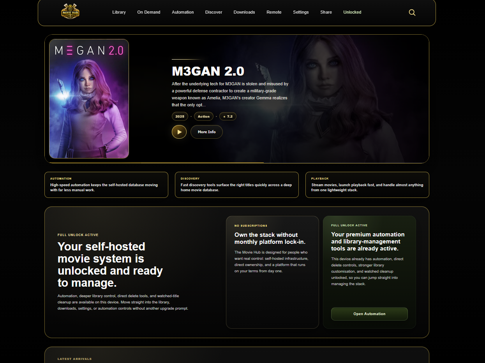
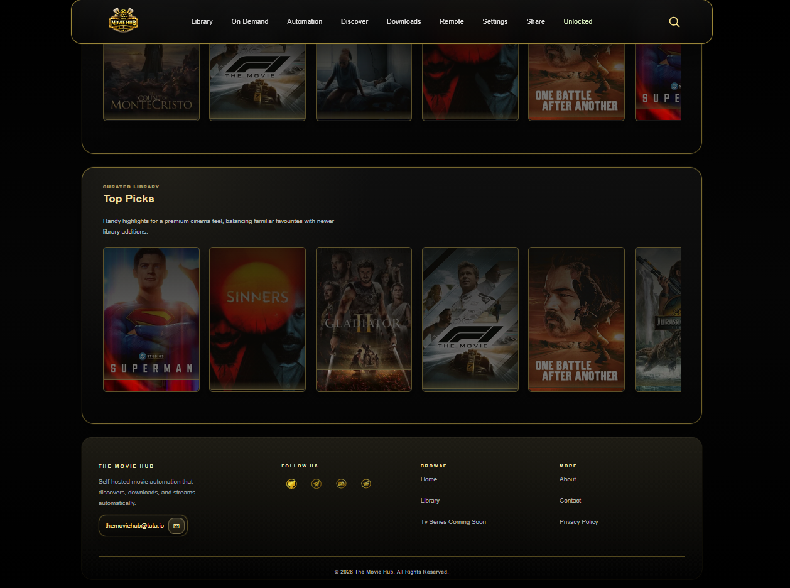
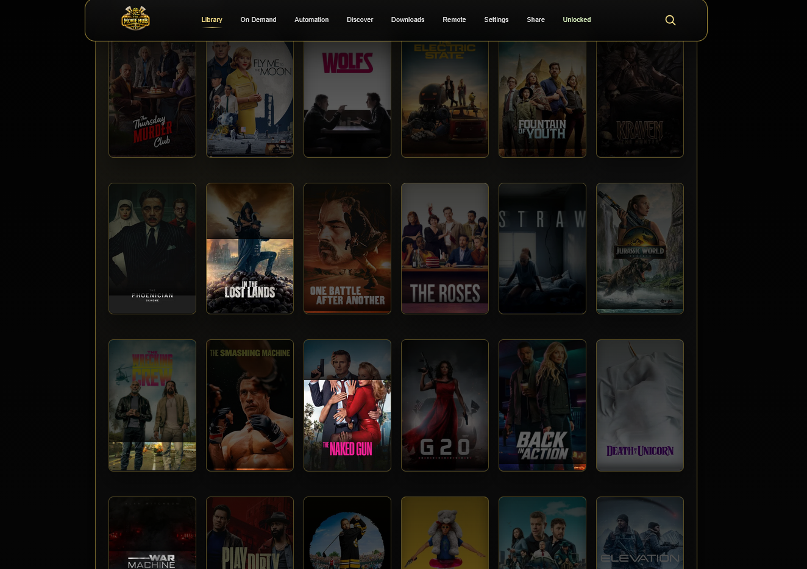
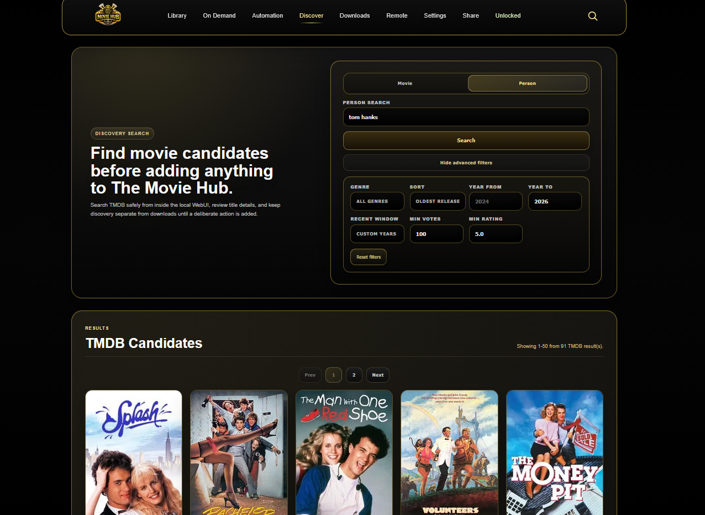
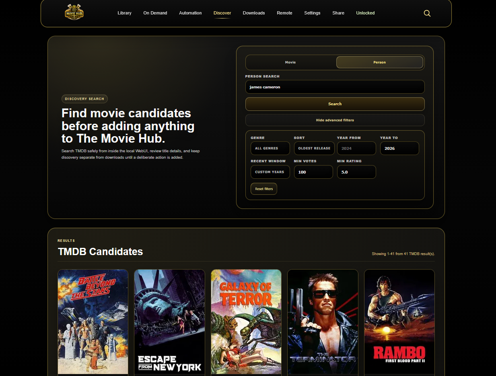
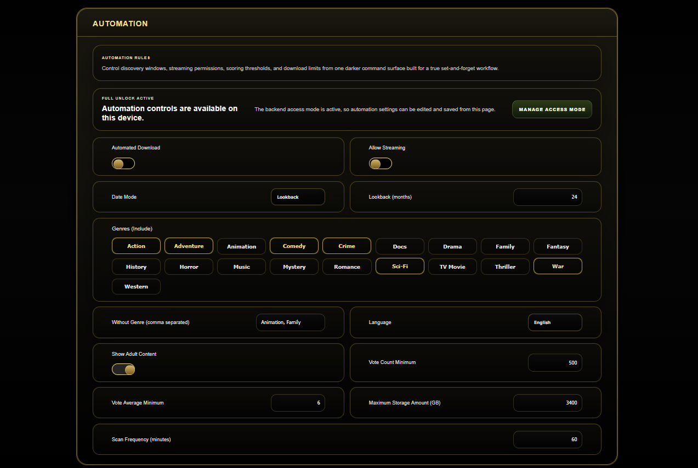
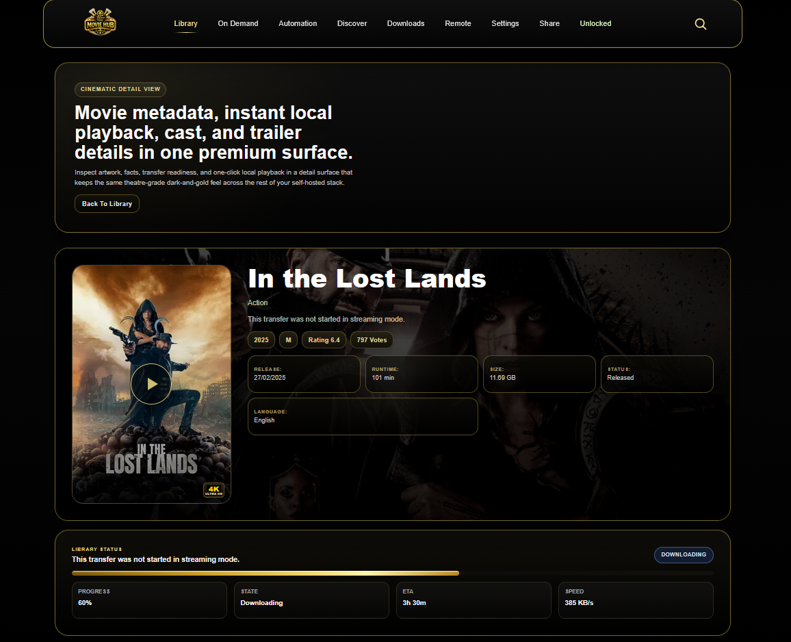
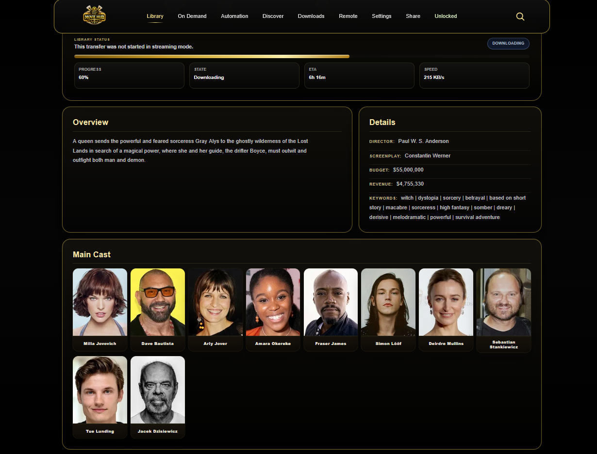
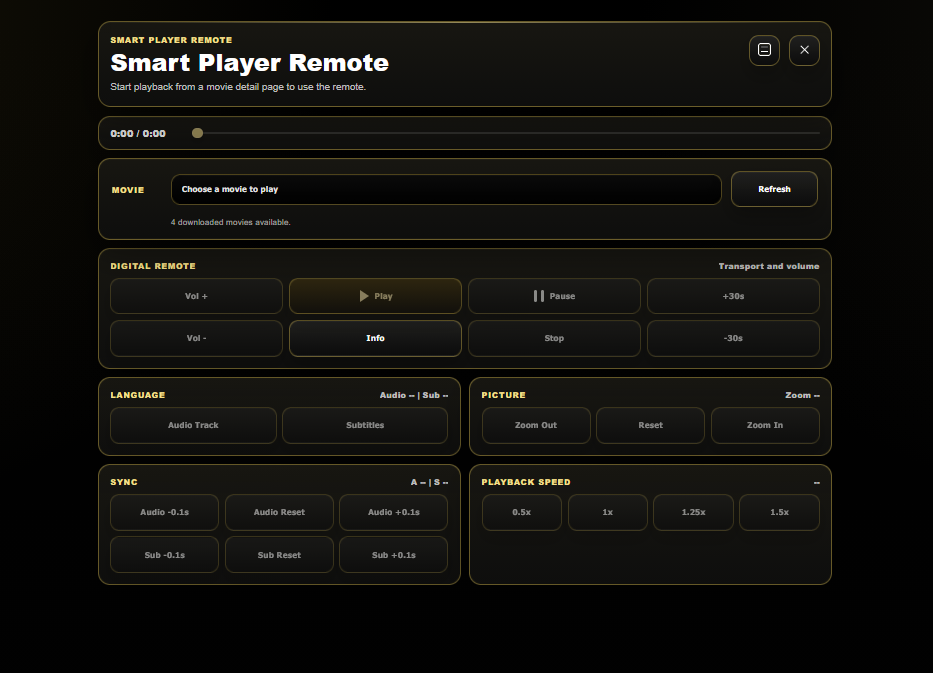
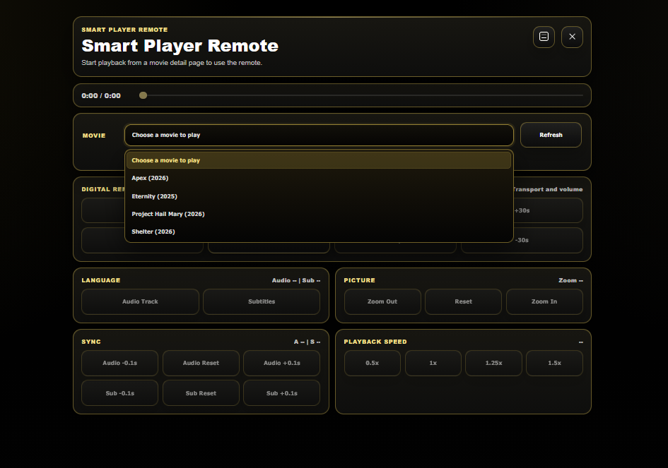

# 🎬 The Movie Hub

**The Movie Hub** is a **super lightweight**, fully automated, headless home media system written in modern C++.

It is engineered for **power users**, long-running operation, and low-overhead 24/7 use. The stack is built around a fast local WebUI, a custom Smart Torrent engine, automated movie discovery, instant stream-ready playback, and a portable Home Control layer that keeps the whole system running from one self-hosted install.

The system **discovers, validates, downloads, streams, organizes, monitors, and plays movies automatically**. Users can search, queue, stream, manage downloads, tune automation, update metadata, and control playback remotely through the Movie Hub WebUI from desktop, tablet, or mobile.

---

## ✨ Key Features

- ⚡ **Ultra-lightweight C++ architecture** designed for low CPU and memory overhead
- 🚀 Fully automated movie discovery, validation, acquisition, and library management
- 🎬 **Instant streaming flow** for supported MKV movie downloads as soon as they become stream-ready
- 🔍 Torrent aggregation through Jackett
- 🧲 **Custom Smart Torrent engine** with active slot management, queueing, slow-torrent replacement, and streaming-aware downloads
- ⚙️ **High-throughput ingestion**
  - ~**2 torrents per second**
  - ~**7,200 torrents per hour**
  - Stress-tested under sustained load
- 🎥 **Smart Player** built on **libmpv** with hardware-aware playback tuning
- 🧠 Advanced duplicate detection using CSV inventory, hash tracking, and fuzzy title matching
- 🛡️ Multi-layer content filtering, metadata matching, and validation
- 💾 Smart storage guard with hard limits
- 📱 Responsive WebUI for desktop, tablet, and mobile
- 🌐 Local Netflix-style movie browsing, discovery, downloads, settings, sharing, and upgrade pages
- 🔑 Customer TMDB API key setup inside Settings with clear setup instructions
- 🔄 Signed software update flow with package verification
- 🧩 Modular system design with separate Home Control, Automation, Smart Torrent, Smart Player, and WebUI layers

---

## 🖥️ Screenshots

### Home Page 1

### Home Page 2

### Home Footer

### Library Page 1

### Library Page 2

### Discovery Page 1

### Discovery Page 2

### Discovery Page 3

### Downloads Page

### On Demand Page

### Automation Page 1

### Automation Page 2

### Movie Detail Page 1

### Movie Detail Page 2

### Movie Detail Page 3

### Remote Page 1

### Remote Page 2

### Settings Page

### Share Page

### Unlock Page

---

## 🧠 Architecture Overview

### Core Components

- **Home Control Server**  
  Local orchestration, hardware detection, WebUI API layer, runtime configuration, TMDB key storage, signed update handling, playback handoff, and system coordination.

- **Full Automation Engine**  
  Discovery, filtering, scheduling, validation, queue handling, and automated movie acquisition.

- **Smart Torrent Engine**  
  High-volume torrent ingestion, active slot control, slow torrent detection, stream-mode handling, metadata checks, and download lifecycle management.

- **Smart Player (libmpv)**  
  Local and streaming playback with hardware-aware tuning, resume support, smart defaults, and configurable playback profiles.

- **WebUI Frontend**  
  Lightweight remote interface for Home, Library, Discovery, Downloads, On Demand, Automation, Settings, Upgrade, Share, and movie detail pages.

---

## 🛠️ Tech Stack

- **Language:** C++ / C++23
- **HTTP:** cpp-httplib, libcurl, WinHTTP
- **Torrent Engine:** Custom Smart Torrent
- **Indexer:** Jackett
- **Media Playback:** Smart Player built on libmpv
- **Metadata:** TMDB
- **Parsing:** nlohmann/json
- **Matching:** rapidfuzz and custom title normalization
- **Filesystem:** std::filesystem with portable path handling
- **Frontend:** HTML / CSS / JavaScript
- **Platform:** Windows portable local install

---

## ⚙️ How It Works

1. The system starts and **loads local configuration, credentials, storage paths, and access mode**.
2. Home Control starts the local WebUI API and coordinates Smart Torrent, Jackett, Smart Player, software updates, and runtime settings.
3. Users configure automation and quality rules:
   - Date ranges
   - Genres
   - Ratings and vote thresholds
   - Resolution preferences
   - File size and format rules
   - Language and subtitle rules
   - Storage guard limits
   - Download queue and slow-torrent replacement settings
4. The automation engine queries Jackett for candidates.
5. Torrents are validated before download:
   - TMDB metadata matching
   - Title and filename verification
   - Year and release-date checks
   - Genre and language filtering
   - Banned word filtering
   - Inappropriate content prevention
6. Smart Torrent ingests valid torrents, manages active download slots, and queues or replaces slow transfers when needed.
7. The WebUI shows download state, library state, streaming readiness, discovery results, and detailed movie pages.
8. Stream-ready MKV downloads can be played through Smart Player before the full download finishes.
9. Fully downloaded movies are organized into the local library and protected by duplicate detection.
10. Smart Player selects playback behavior based on detected hardware and saved playback settings.

---

## 🔑 TMDB Metadata Setup

The Movie Hub uses **TMDB** for Discovery, posters, backdrops, genres, cast details, movie matching, and cleaner library metadata.

Customers can add their own free TMDB key inside:

**Settings → General → TMDB Metadata Key**

The Settings page includes:

- Current TMDB key status
- Password-protected key entry
- Show/hide key control
- Save key button
- A direct link to the TMDB API setup page
- Step-by-step setup guidance

Users should paste the **API Key (v3 auth)** from TMDB. The longer **API Read Access Token** is not the key used by this app.

The saved key is stored locally in:

`The Movie Hub/config/credentials.conf`

The WebUI only displays a masked version after saving and does not print the full key back to the browser.

---

## 🛡️ Advanced Filtering & Safety

The Movie Hub applies **multi-layer validation** to improve accuracy and reduce unwanted matches:

- TMDB title, year, poster, backdrop, and metadata matching
- Genre enforcement
- Date-range enforcement
- Language and subtitle preference handling
- Banned word filtering
- Title-to-file verification
- Duplicate prevention through CSV and hash tracking
- Inappropriate content prevention
- Storage-limit enforcement before download
- Queue handling for unavailable or slow downloads

---

## 💾 Smart Storage Management

- User-defined movie library folder
- Separate temporary download folder
- Separate streaming folder for stream-mode downloads
- Hard storage guard limits
- Automatic cleanup and library refresh controls
- Designed to prevent disk exhaustion during long-running automation

---

## 📺 WebUI Pages

- **Home**  
  Landing dashboard, playback feature overview, latest arrivals, and key status sections.

- **Library**  
  Local movie library with search, quick views, genre filters, sorting, pagination, and premium management controls.

- **Discovery**  
  TMDB-powered movie discovery with filters, detail views, and download actions.

- **Downloads**  
  Smart Torrent status, active download slots, queue state, progress, speeds, and torrent controls.

- **On Demand**  
  Search and request a movie directly through the WebUI.

- **Automation**  
  Automation status, rules, scheduling, and premium automation controls.

- **Settings**  
  Runtime paths, TMDB key setup, Smart Torrent settings, Smart Player tuning, quality scoring, download rules, streaming rules, privacy, software updates, and reset tools.

- **Upgrade**  
  Free Core and Full Unlock information, local unlock state, and premium feature overview.

- **Share**  
  Referral hash, share actions, and referral status tools.

---

## ⚡ Performance & Efficiency

- Built for continuous local operation
- Extremely low CPU and memory overhead
- Designed to stay responsive while automation and downloads are active
- Smart Torrent can ingest large candidate sets quickly
- WebUI remains lightweight and local-first
- Smart Player uses hardware-aware settings for smoother playback

---

## 🚧 Project Status

> **Active Development**

Current focus areas:

- Mobile and tablet WebUI polish
- Release candidate hardening
- Smart Torrent slot and queue behavior
- Discovery and metadata reliability
- Settings clarity for customer setup
- Signed update flow
- Packaged portable release workflow

Planned enhancements:

- More guided first-run setup
- Stronger customer onboarding
- Optional secure remote access outside LAN
- Multi-device playback targets
- Packaged deployment for mini-PC / appliance use

---

## ⚠️ Legal Notice

This project is intended for **personal media management and educational use only**.

Users are responsible for complying with all applicable local laws, regulations, copyright rules, and content-access restrictions in their region.

---

## 📜 License

MIT License
